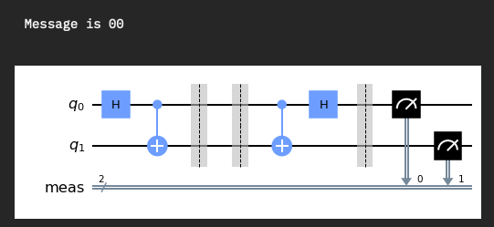
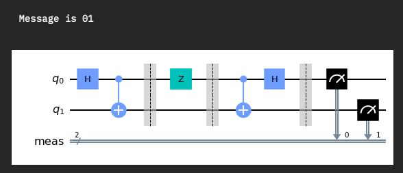
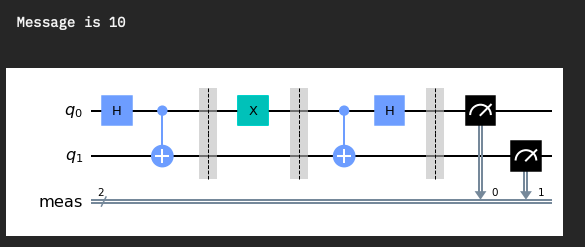
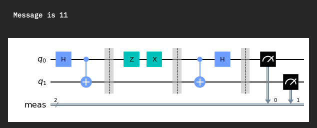

# Protocolo de Codificación Superdensa

## Autores

| **Nombre(s) y Apellidos** |              **Correo**              | **Grupo** |
| :-----------------------: | :----------------------------------: | :-------: |
|        Carlos Alejandro Arrieta Montes de Oca         |      carlozalejandro98@gmail.com       |   C-512   |
| Reinaldo Barrera Travieso |  reinaldobarrera9601@gmail.com  |   C-511   |
|   Ariel Plasencia Díaz    | arielplasencia00@gmial.com |   C-512   |

## Implementación y Ejecución

### Implementación

La parte computacional del proyecto está implementada completamente en [python 3](https://es.wikipedia.org/wiki/Python). Python es un lenguaje de programación interpretado cuya filosofía hace hincapié en la legibilidad de su código. Se trata de un lenguaje de programación multiparadigma, ya que soporta parcialmente la orientación a objetos, programación imperativa y, en menor medida, programación funcional. Es un lenguaje interpretado, dinámico y multiplataforma. Nos apoyamos en varias librerías provistas por dicho lenguaje de programación para una mejor y mayor comprensión en el código.

Para la instalación de las librerías ejecutamos el siguiente comando:

```bash
pip3 install -r requirements.txt
```

### Ejecución

Para ejecutar nuestro proyecto es necesario escribir las siguientes líneas desde una terminal abierta en esta misma dirección:

```bash
cd src/
python3 main.py
```

Además, proveemos un `makefile` con las siguientes funcionalidades:

```text
run                            Run the project ;)
info                           Display project description
version                        Show the project version
install                        Install the project dependencies
clean                          Remove temporary files
help                           Show this help
```

## Codificacion Superdensa

La codificación superdensa, en teoría cuántica de la información, es un proceso en el cuál se pueden transmitir dos bits clásicos almacenados en un qubit entre dos posiciones (lo suficientemente alejadas para que no haya  influencia alguna entre los sistema) y mediante un canal cuántico. Se denomina superdensa porque podemos enviar en un solo qubit dos bits. El estado cuántico que se transmite es lo que se llama qubit, que no es más que el análogo cuántico del bit. Un bit es, en resumidas cuentas, un sistema que puede existir en dos estados distintos, por ejemplo, para representar 0 y 1. Entonces, un qubit será un sistema cuántico cuyo espacio de estados tiene dimensión 2. Uno de los requisitos es tener un qubit en cada posición, que estarán entrelazados. Este proceso es similar al de la teleportación cuántica, en la cual se quiere teleportar un estado cuántico de un sistema a otro mediante la transmisión por un canal clásico de dos bits clásicos. Se podría decir que la teleportación cuántica y la codificación  superdensa son "procesos inversos" ya que, el procedimiento para uno de ellos es similar al del otro, pero de forma  inversa. Una característica que comparten ambos procesos es que necesitan de un estado entrelazado, siendo este estado uno de los  pertenecientes a la base de Bell.

## Capturas de pantalla







